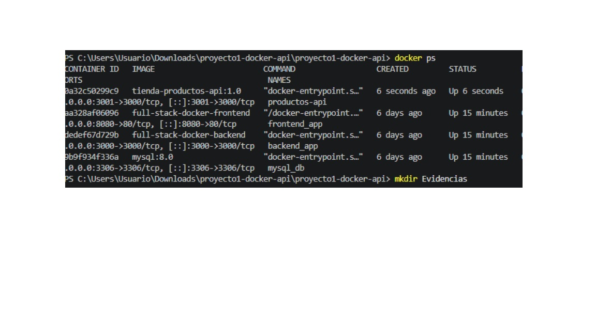
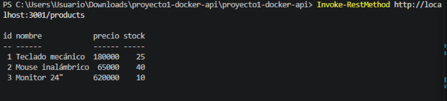
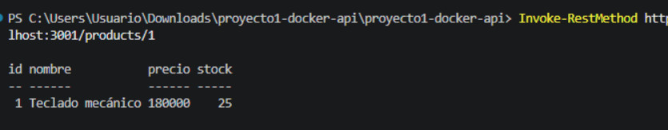
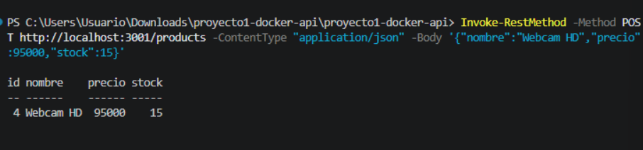
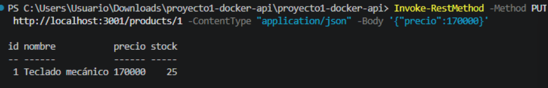
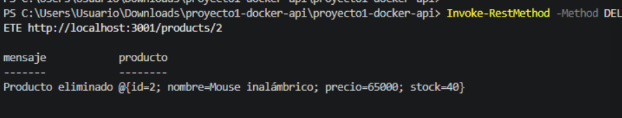
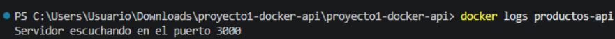

# Proyecto 1 — API REST de Productos dockerizada

## Descripción
API REST para una tienda virtual que gestiona un catálogo de productos en memoria.
Está construida con **Node.js** y **Express**, y empaquetada en una **imagen Docker
propia** para poder ejecutarse en cualquier equipo sin instalar Node.js localmente.

## Requisitos
- [Docker](https://www.docker.com/) instalado y corriendo.
- (Opcional, solo si quieres correr sin Docker) Node.js 20+ y npm.
- `curl` o [Postman](https://www.postman.com/) para probar los endpoints.

## Endpoints disponibles

| Método | Ruta             | Descripción                     |
|--------|------------------|----------------------------------|
| GET    | /products        | Lista todos los productos        |
| GET    | /products/:id    | Obtiene un producto por id       |
| POST   | /products        | Crea un nuevo producto           |
| PUT    | /products/:id    | Actualiza un producto existente  |
| DELETE | /products/:id    | Elimina un producto              |

Un producto tiene la forma:
```json
{ "id": 1, "nombre": "Teclado mecánico", "precio": 180000, "stock": 25 }
```

## Construcción de la imagen

```bash
docker build -t tienda-productos-api:1.0 .
```

## Ejecución del contenedor

```bash
docker run -d --name productos-api -p 3000:3000 tienda-productos-api:1.0
```

- `-d` corre el contenedor en segundo plano.
- `--name productos-api` le da un nombre fijo al contenedor.
- `-p 3000:3000` mapea el puerto 3000 del contenedor al puerto 3000 de tu máquina.

## Verificar que está corriendo

```bash
docker ps
```

## Ver logs del contenedor

```bash
docker logs productos-api
```

## Probar los endpoints con curl

```bash
# Listar productos
curl http://localhost:3000/products

# Obtener un producto por id
curl http://localhost:3000/products/1

# Crear un producto
curl -X POST http://localhost:3000/products \
  -H "Content-Type: application/json" \
  -d '{"nombre":"Webcam HD","precio":95000,"stock":15}'

# Actualizar un producto
curl -X PUT http://localhost:3000/products/1 \
  -H "Content-Type: application/json" \
  -d '{"precio":170000}'

# Eliminar un producto
curl -X DELETE http://localhost:3000/products/2
```

## Detener y eliminar el contenedor

```bash
docker stop productos-api
docker rm productos-api
```

## Ejecución sin Docker (opcional, para desarrollo local)

```bash
npm install
npm start
```

## Evidencias

> Reemplaza esta sección con tus propias capturas de pantalla antes de entregar:

### Contenedor en ejecución (`docker ps`)


### GET /products


### GET /products/1


### POST /products


### PUT /products/1


### DELETE /products/2


### Logs del contenedor
